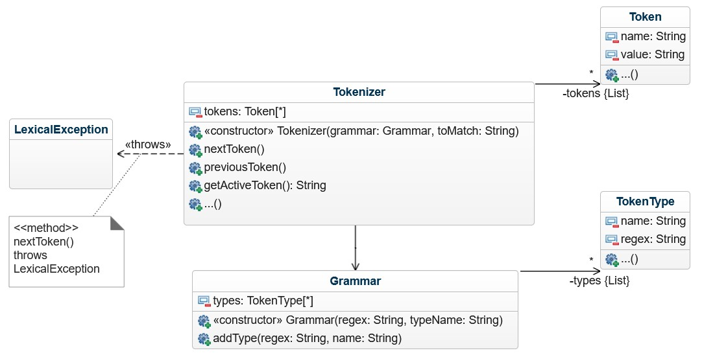
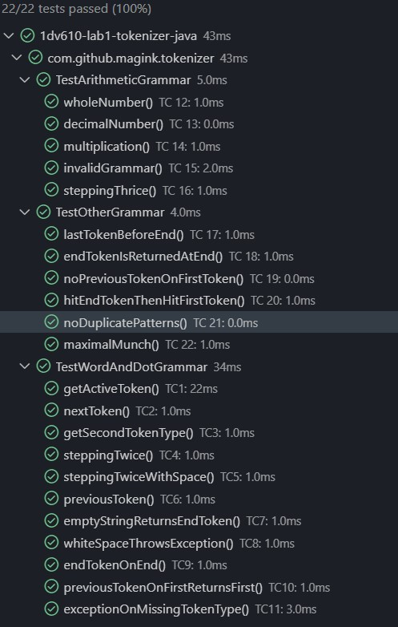

## Checklista

- [X] I min tokeniserare finns inga tokentyper eller reg-exp. Dessa finns i ~~mitt testprojekt~~ mina junit tester eftersom de skapas utav användaren.
- [X] Jag har skrivit all kod och reflektioner själv. Jag har inte använt mig av andras kod för att lösa uppgiften.
- [X] Mina testresultat är skrivna utifrån utförd testning ( och inte teoretiskt, det bör fungera :) )
- [X] De enda statiska metoder eller funktioner utanför klasser som jag har är för att starta upp min testapplikation ex main(java).
- [X] De enda bibliotek och färdiga klasser som används är sådana som måste användas (eller som används för att testa modulen).

## Egenskattning och mål

- [ ] Jag är inte klar eftersom jag vet att jag saknar något. Då skall du inte lämna in!
- [X] Jag eftersträvar med denna inlämning godkänt betyg (E-D)
  - [X] De flesta testfall fungerar
  - [X] Koden är förberedd på Återanvändning
  - [X] All kod samt historik finns i git
  - [X] Kodkvaliterskraven är ifyllda
  - [X] Reflektion är skriven
- [ ] Jag eftersträvar med denna inlämning högre betyg (C-B) och anser mig uppfylla alla extra krav för detta.
  - [X] Samtliga testfall är skrivna
  - [x] Egna testfall för Maximal munch och kantfall
  - [ ] Testfall är automatiserade
  - [X] Det finns en tydlig beskrivning i hur modulen skall användas (i git)
  - [X] Kodkvalitetskraven är varierade
- [ ] Jag eftersträvar med denna inlämning högsta betyg (A)

Förtydligande: Examinator kommer sätta betyg oberoende på vad ni anser.

## Återanvändning

<!-- Beskriv hur du anpassat din kod och instruktioner för att någon annan programmerare skall kunna använda din tokenizer. Om du skrivit instruktioner för din användare länka till dessa. Om inte beskriv här hur någon skall göra för att använda din kod med sin egen grammatik. -->

Jag har skrivit en README.md som innehåller en beskrivning på hur man använder java klasserna. Det finns även flera kodexempel för de olika metoderna man använder. Publika metoder har java docs där otydlighet kan finnas.

Klasserna är packade i en .jar fil som en användare kan ta in som referensbibilotek till deras projekt. Hur detta sker varierar beroende på vilket verktyg och utvecklingsmiljö användaren kör. I detta projektet har jag kört med Visual Studio Code och Java Extension Pack, utan Maven eller Gradle.

## Beskrivning av min kod

<!-- Beskriv din kod på en hög abstraktionsnivå. En kort beskrivning av dina viktigaste klasser och metoder. Skapa gärna ett klassdiagram som bild. -->

Min tokenizer består av 5 klasser;  

- Grammar och Tokenizer, som en användare interagerar med direkt;
- TokenType och Token, som kapslar in viktiga koncept för lösningen;
- samt en liten liten klass LexicalException, som definerar ett undantag för när inga matchningar kunde göras mot ett tecken.

Grammar och Tokenizer klasserna sköter de tunga lyften.
Användaren skapar ett Grammar objekt och skickar in typnamn och regex som med `addType()` metoden för att definera en tokentyp. När användaren skickat in alla tokentyper skapar användaren ett Tokenizer objekt och skickar in Grammar objektet och strängen att analysera. Användaren kan stega i Tokenizern med `nextToken` och `previousToken()`, tills det att användaren når "kanterna" och får tillaka antigen det första tokenet eller ett END-token.

## Hur jag testat

Jag har använt junit 5 och skrivit tester som jag kört vid kodändringar.
Testerna är indelade efter de olika grammatikerna jag testat. Mina egna testfall finns i filen TestOtherGrammar.java

### Testfall

<!-- Lista de enskilda testfallen. **Fetmarkera** sådant som du själv fyllt i. En rad per testfall. -->

| Namn      | Grammatik | Sträng | Sekvens | Förväntat aktivt Token | PASS/FAIL |
| --------- | --------- | ------ | ------- | ------------ | --------- |
| TC1 getActiveToken() | WordAndDotGrammar| "a" | [] | WORD("a") | PASS |
| TC2 nextToken() | WordAndDotGrammar| "a aa" | [>] | WORD("aa") | PASS |
| TC3 getSecondTokenType() | WordAndDotGrammar| "a.b" | [>] | DOT(".") | PASS |
| TC4 steppingTwice() | WordAndDotGrammar| "a.b" | [>>] | **WORD("b")** | PASS |
| TC5 steppingTwiceWithSpace() | WordAndDotGrammar| "aa. b" | **[>>]** | WORD("b") | PASS |
| TC6 previousToken()| WordAndDotGrammar| "a .b" | [>><] | DOT(".") | PASS |
| TC7 emptyStringReturnsEndToken()| WordAndDotGrammar| "" | [] | END("") | PASS |
| TC8 whiteSpaceThrowsException()| WordAndDotGrammar| " " | [] | **LexicalException** | PASS |
| TC9 endTokenOnEnd()| WordAndDotGrammar| "a" | **[>]** | END("") | PASS |
| TC10 previousTokenOnFirstReturnsFirst()| WordAndDotGrammar| "a" | [<] | **WORD("a")** | PASS |
| TC11 exceptionOnMissingTokenType()| WordAndDotGrammar| "3" | **[]** | LexicalException | PASS |
| TC12 wholeNumber()| ArithmeticGrammar| "3" | [] | NUMBER("3") | PASS |
| TC13 decimalNumber()| ArithmeticGrammar| "3.14" | [] | NUMBER("3.14") | PASS |
| TC14 multiplication()| ArithmeticGrammar| "3 + 54 * 4" | [>>>] | MUL("*") | PASS |
| TC15 invalidGrammar()| ArithmeticGrammar| "3+5 # 4" | [>>>] | LexicalException | PASS |
| TC16 steppingThrice()| ArithmeticGrammar| "3.0+54.1     + 4.2" | [>>>>>] | ADD("+") | PASS |
| **TC17 lastTokenBeforeEnd()** | ExclamationGrammar| "Ta en öl Dino!!" | [>>>>>] | EXCLAMATION("!") | PASS ** |
| **TC18 endTokenIsReturnedAtEnd()** | CommaGrammar| "Doors and corners, kid" | [>>>>>] | END("") | PASS |
| **TC19 noPreviousTokenOnFirstToken()** | WordAndDotGrammar| "No laws in Ceres. Just cops." | [<<] | WORD("No") | PASS |
| **TC20 hitEndTokenThenHitFirstToken()** | WordCommaAndDotGrammar| "Go into a room too fast, kid, the room eats you" | [>>>>>>>>>>>>>>><<<<<<<<<<<<<<<] | WORD("No") | PASS |

<!-- Du kan tillföra kommentarer om din tokeniserare skiljer sig något från standard. -->

Tokenizern klarar ej av anchor beginning (**^**\w+) i regexen. Kör utan.

### Testfall för högre betyg

Lista de enskilda testfallen. En rad per testfall.
| Namn      | Grammatik | Sträng | Sekvens | Förväntat Aktivt Token | PASS/FAIL |
| --------- | --------- | ------ | ------- | ------------ | --------- |
| **TC21 maximalMunch()**| IntegerFloatGrammar| "3.14 5" | [] | FLOAT("3.14") | PASS |

## Kodkvalitetskrav

<!-- **Fetmarkera** de "regler" som används ur CC. Ni kan frångå tabellformat om ni vill. Skapa direktlänkar till er kod där det är lämpligt. -->

### Namngivning

| Namn | Förklaring | Reflektion |
| ---  | ---| --- |
| `addType()` | metodnamn i klassen Grammar som lägger till nya tokentyper | **Method names**: Metoden har en verb-liknande fras. **Use Problem Domain Names**: För att förstå vad en "type" är inom kontexten Grammar bör man ha en förståelse av problemdomänen. **Add meaningfull context**: Kanske hade det varit bättre att kalla den `addTokenType()` för att bygga mer kontext.|
| `getActiveToken()` | metodnamn i klassen Tokenizer som hämtar aktivt token som en String | **Use Intention-Revealing names**: Exakt vad det är jag hämtar är otydligt, även om man är insatt domänexpert och vet att ett token har ett värde och en typ, så säger det ingeting om vad jag får av metoden annat än att typen på retur-värdet är av String. Kanske skulle jag kallat den `getActiveTokenTypeAndValue()`, men då börjar jag snudda på **Avoid Disinformation** då jag redan har metoderna `getActiveTokenValue` och `getActiveTokenType`; kan bli otydligt när flera är så snarlika. |
| `toMatch` | konstruktor-parameter och medlemsvariabel i Tokenizer, som definerar in-strängen som ska bli analyserad | **Make meaningful distinctions**: Med "to"-prefixet läser man "String to Match", vilket jag upplever ökar läsbarheten jämfört med mitt tidigare namn "input", vilket säger mindre om syftet. |
| `Token` | klass som definerar ett Token objekt av typ och värde. | **Use Problem Domain Names** Man måste vara bekant med problemdomänet för att förstå vad Token innebär i kontexten. **Class Names** är inte ett verb utan ett substantiv.  |
| `nextToken()`, `previousToken` | Metoderna stegar framåt respetive bakåt i listan av tokens | **Method names**: metoderna kan vara svårtolkade iom att det inte är verb. `goToNextToken()` hade kanske varit tydligare. **Use solution domain names**: Man måste förstå att analysen av strängen sker stegvis, vilket inte nödvändigtvis är den enda lösningen på problemet, för att förstå vad nextToken innebär.  |

### Funktioner

| Namn | Rader | Förklaring | Reflektion |
| ---  | ---| --- | --- |
| `foundMatch()` | 19 | Metoden med själva algoritmen som hittar nästa och längsta matchning. |**small!**: Metoden är mycket större än vad den borde vara, dels för att enkelt komma åt lokala variabler som används i loopen. Alternativet hade kanske varit att bryta ut och skicka med referenser till variablerna som parametrar istället. **Do One Thing**: Man kan se som att koden gör flera saker inom kontexten att hitta nästa token, den kastar t.ex. även ett Exception. Loopen hade kunnats brytas ut till en egen metod och koden hade blivit 11 rader kortare. **Structured Programming**: Jag använder `continue` för att gå till nästa iteration i loopen om ingen matchning hittas för typen, jag själv tycker dock att koden fortfarande är hyffsat lätt ett följa trots `continue` och det blir ändå bare en exit-point. **Use Descriptive Names**: "found" gör att namnet kan bli misstolkat till att man får tillbaka en boolean, inte den faktiska Token som hittades.
| `makePattern()` | 11 | Metod i Grammar som bygger upp en lång regex av en eller flera kortare regexes samt gör en pattern av dessa. | **Do One Thing**: Koden bygger just nu en lång sträng och kallar sen på Pattern.compile() vilket är två saker, ena kunde brytits ut. **One Abstraction Per Level**: Att bygga strängen är på en lägre abstraktionsnivå än vad Pattern compile är. Här kunde hela strängbyggandet lagts i en egen metod. **Function arguments**: Niladic/noll argument, lätt att använda metoden eftersom man inte behöver förstå vad man ska skicka med.
| `hasEndToken()` | 6 | metod i Tokenizer som kollar om sista token är av END-typ | **Use Descriptive Names**: has hintar om att returvärdet är boolean och metodnamnet säger ganska exakt vad metodens syfte är. **Sections within Functions/One thing**: Det finns bara en kedja av metodanrop i metoden, där kedjan brytits upp till ett anrop per rad för readability. Detta kan ses som att den gör flera saker.
| `findMatch()` | 5 | Kallar på `foundMatch()` och kollar om foundMatch hittade nästa Token | **Use Descriptive Names**: Namnet är väldigt snarlikt `foundMatch()` och vad det det är som skiljer sig är otydligt. När metoderna visas i callstacken blir det genast ganska tydligt att strukturen kan vara svårtolkad `findNextToken()` -> `findMatch()` -> `foundMatch()`.
| `addType()` | 5 | Lägger till en ny typ i Grammar | **Do One Thing**: Koden lägger till den nya grammatiken man kallar också på `makePattern()` varje gång. Detta bryter mot **Have No Side Effects**, framförallt då den kan kasta en unchecked exception, PatternSyntaxException om det inte är en riktig regex.

## Laborationsreflektion

<!-- Reflektera över uppgiften utifrån ett kodkvalitetsperspektiv. Använd begrepp ifrån boken. -->

Denna laboration har för mig varit en pågående påminnelse om att ta ett steg tillbaka och försöka förstå om jag eller någon annan 6 månader fram i tiden kan tolka min lösning.

Det jag märkte mycket själv är hur mycket kod jag gärna lägger i enskilda metoder istället för att bryta upp dem och låta dem **göra en sak**. Det blir snabbt en komplicerad kedja av anrop som förgrenar sig nere i metodmörkret under en if-sats som egentligen nog hade varit bäst som en egen metod. Detta gör snabbt metoderna oöverskådliga vid en snabb anblick och kräver tid (även för mig som just skrivit dem) att tolka dem då metodernas ansvarsområden överlappas, vid t.ex. debugging.

Det är bra att tänka efter några gånger innan man börjar lägga in massor parametrar som en användare måste ange för att använda klassen. Man måste dock även fråga sig om alternativen till det förstärker kodförståelse eller skapar förustättningar för **sidoeffekter** och gör innebörden av metoden diffus. T.ex. att man börjar ta input till metoden från ett fält, vilket gjorde att användaren förlorade kontexten att *metoden gör något med den här datan* .

Där man inte kommer från funktioner med parametrar bör man nästan vara övertydlig och inte bara tänka på verb-substantiv namn, utan att använda terminologi från problem- eller lösningsdomänen, möjligen hinta om retur-värdet med is/has/get/..etc.

Att bara ha metoder med en return/exit-point och undvika continue, break, goTo...etc, är något jag följt minst bra då jag har ett par metoder med return på flera ställen samt continue i en for-loop; men då dessa metoder är så små och när det används är syftet tydligt (null-check i fallet continue), så tycker jag inte de förstör läsbarheten så som de ser ut just nu.

Det som jag främst tar till mig efter denna laboration är att inte vara rädd att gå tillbaka till tidigare kod och refaktorera de delar som jag upplever som "röriga"; för om jag upplever dem som röriga så kommer en annan programmerare garanterat också att göra det.  
